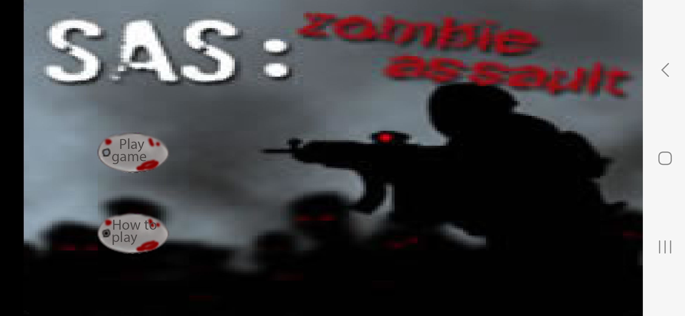
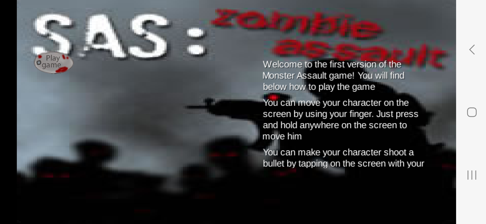
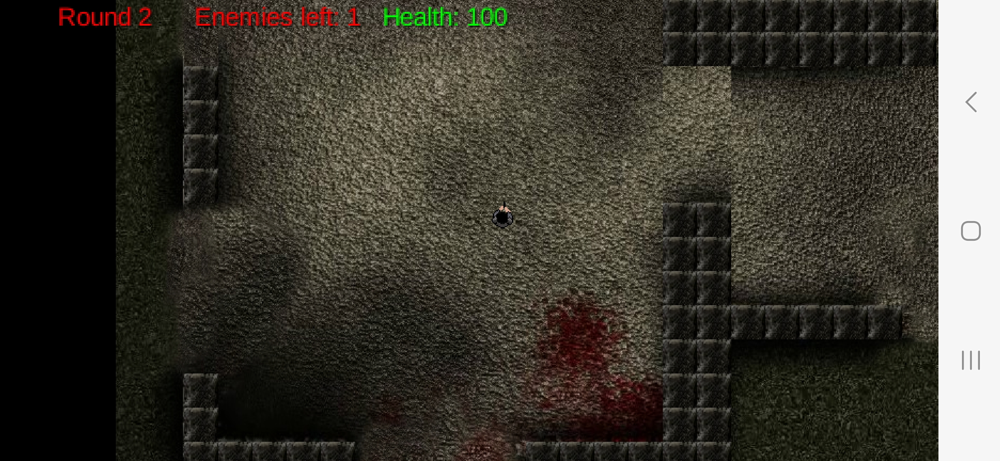
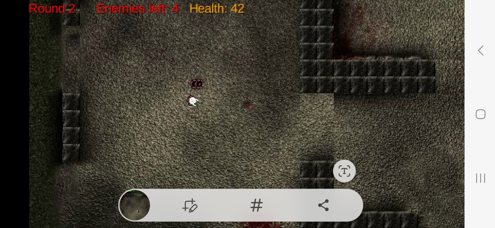
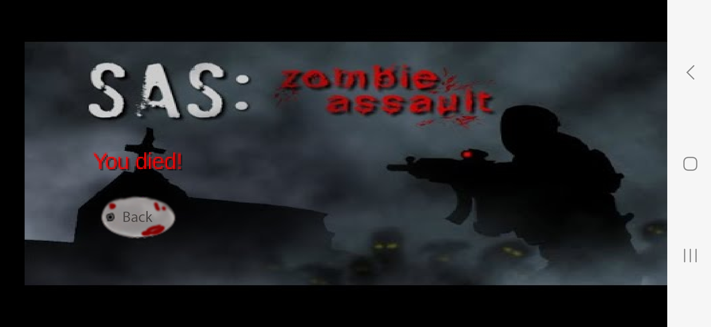

# Monster Assault

<!-- TABLE OF CONTENTS -->
<section>
  <article>
    <ol>
     <li><a href="#about-the-project">About The Project</a></li>
     <li><a href="#purpose-of-project">Project purpose</a></li>
     <li><a href="#built-with">Built With</a></li>
     <li>
        <a href="#getting-started">Getting Started</a>
        <ul>
          <li><a href="#prerequisites">Prerequisites</a></li>
          <ul>
            <li><a href="#if-on-windows">If on Windows</a></li>
            <li><a href="#if-on-macos">If on MacOS</a></li>
            <li><a href="#if-on-linux">If on Linux</a></li>
          </ul>
          <li><a href="#installation">Installation</a></li>
        </ul>
     </li>
     <li><a href="#usage">Usage</a></li>
     <li><a href="#contributing">Contributing</a></li>
     <li><a href="#contact">Contact me</a></li>
    </ol>
  </article>
</section>

<section>
  <article>
    <!-- ABOUT THE PROJECT -->
    <h2 id="about-the-project">About The Project</h2>

  </article>

### [Go look at MonsterAssault live on the Google Play Store](https://play.google.com/store/apps/details?id=com.jacobdgraham.monsterassault)

</section>

<section>
  <!-- PURPOSE OF PROJECT -->
  <h2 id="purpose-of-project">About The Project</h2>
  
The purpose of creating MonsterAssault was to expose myself to mobile game development, and to 
     create the foundations for a mobile game which I will be consistently updating and improving
     for years to come. 

</section>

<section>
  <h2 id="built-with">Built with</h2>
  <ol>
    <li><a href="https://www.java.com/en/" title="A uri which goes to the main Java website">Java</a></li>
    <li><a href="https://libgdx.com/" title="A uri which goes to the LibGDX website">LibGDX</a></li>
    <li><a href="https://www.android.com/intl/en_ca/" title="A uri which goes to the main Android website">Android</a></li>
    <li><a href="https://gradle.org/" title="A uri to the main Gradle website">Gradle</a></li>
    <li><a href="https://www.adobe.com/ca/products/photoshop.html" title="A uri to the main Adobe Photoshop website">Photoshop</a></li>
    <li><a href="https://freesound.org/" title="A uri to the Freesound website">Free sounds</a></li>
  </ol>
</section>

<section>
  <article>
    <h2 id="getting-started">Getting started</h2>
    
The following section gives you instructions on the prerequisites you need to download Monster Assault locally on your own phone.

  </article>

  <article>
    <h3 id="prerequisites">Prerequisites</h3>
    
First, you must have a phone which has the Android operating system installed on it.

  </article>

  <article>
    <h2 id="installation">Installation</h2>
        <h4 id="if-on-windows">When using an Android device</h4>
        
Click on the link <a href="https://play.google.com/store/apps/details?id=com.jacobdgraham.monsterassault" title="A uri to my Monster Assault mobile game in the Google Play Store">Here</a> and press the big green 'Install' button to begin installing onto your mobile device

  </article>
</section>

<section>
  <article>
    <h2 id="contributing">Contributing</h2>
    Contributions are what make the open source community such an amazing place to learn, inspire, and create. Any contributions that you make are greatly appreciated.
  </article>
   
  <article>
    If you have a suggestion that would make this better, please fork this repository and create a pull request. You can also simply open an issue with the tag "enhancement".
  </article> 
   
  <article>
    Below are some example steps on how to create a pull request for this repository:
    <ol>
      <li>Fork the Project</li>
      <li>Create your Feature Branch (`git checkout -b feature/AmazingFeature`)</li>
      <li>Commit your Changes (`git commit -m 'Add some AmazingFeature'`)</li>
      <li>Push to the Branch (`git push origin feature/AmazingFeature`)</li>
      <li>Open a Pull Request</li>
    </ol>
  </article>
</section>

<section>
  <article>
    <h2 id="contact">Contact me</h2>
    

      Jacob Graham - jakegraham54@gmail.com
    

  </article>
</section>

<section>
  <aside>
    
(<a href="#readme-top">back to top</a>)

  </aside>
</section>

